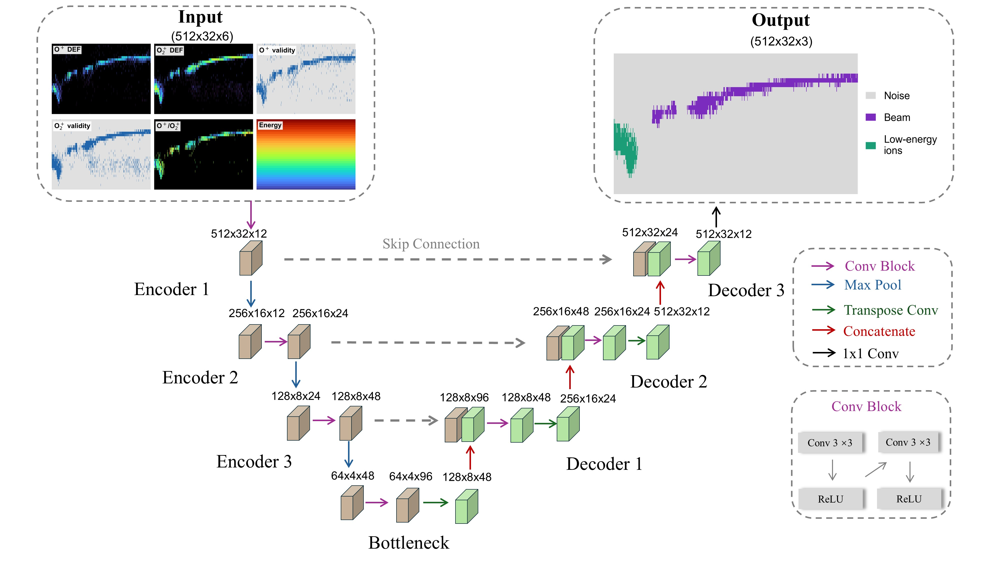
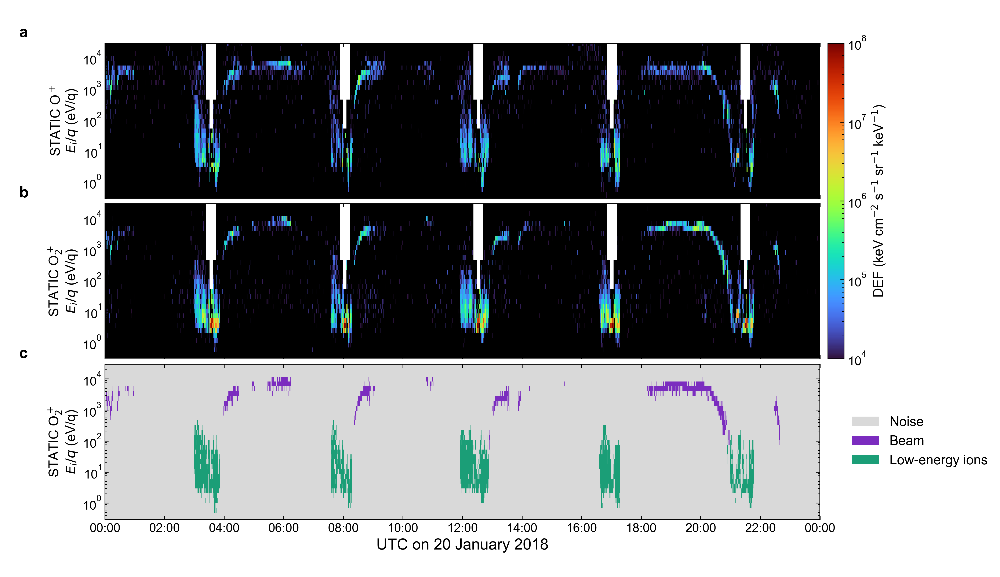

# U-Net Mars O2 Energetic Beams

PyTorch inference code and trained parameters for **U-Net v10**, which segments background-corrected MAVEN STATIC O+ and O2+ energy-time spectrograms into **Noise, Beam, and Low-energy ions**.



The diagram summarizes the six inputs and three outputs. Its panel arrangement is illustrative, not the tensor channel order. Each convolution block also contains GroupNorm before ReLU; see the implementation and model card.

## Installation

```bash
git clone https://github.com/ChiZhang123456/U-Net_Mars_O2_Beams.git
cd U-Net_Mars_O2_Beams
python -m pip install -r requirements.txt
python -m pip install -e .
```

Requires Python 3.10+, NumPy, and PyTorch. Matplotlib is used for plotting examples. CPU and CUDA inference are supported.

## Quick start

```bash
python examples/run_example.py --device cpu
```

This synthetic example loads the v10 weights and writes `prediction.npz`.

## Real MAVEN example: 20 January 2018

A compact full-day array dataset is included, with background-corrected, aligned O+ and O2+ DEF and saved v10 predictions:

```bash
python examples/plot_20180120_full_day.py
python examples/plot_20180120_full_day.py --rerun-inference --device cpu
```

The first command plots saved predictions; the second reproduces them using the released checkpoint. Panels show corrected O+ DEF, corrected O2+ DEF, and the three-class prediction. No manual prediction overrides or production event filtering are applied.



Use `--data your_example.npz` for an alternative aligned dataset with `time`, `energy_ev`, `o_def`, `o2_def`, and `labels` (v10 IDs 0/1/2). This plotting script fixes the displayed interval to 20 January 2018. Optional `--regions intervals.csv` accepts `region,start_utc,end_utc` with SW/MSH/MSP codes.

## Run on your spectra

**Apply STATIC C6 background correction once, before extracting species DEF and constructing channels.** The generic array API does not retrieve or background-correct raw CDF files. Do not supply uncorrected spectra or apply the correction twice. The model input uses C6; D1 moment calculations are a separate downstream workflow.

The input preprocessing uses `py_space_zc.maven.static.correct_bkg_c6` with the local iv4 background product. O+ mass bins 14–20 and O2+ mass bins 24–40 were summed, then each spectrum was interpolated linearly in DEF against log10 energy onto a common 32-bin grid. Out-of-range values are NaN. The bundled example provides the reference energy grid.

| NPZ key | Shape | Meaning |
| --- | --- | --- |
| `o_def` | `[time, 32]` | Background-corrected O+ DEF |
| `o2_def` | `[time, 32]` | Background-corrected O2+ DEF |
| `energy_ev` | `[32]` | Finite, positive common energy centers in eV |

DEF uses keV cm^-2 s^-1 sr^-1 keV^-1. Arrays must share time and energy grids.

```bash
python examples/run_example.py --input your_corrected_spectra.npz --output prediction.npz
```

Output keys are `probabilities` (`[3,time,32]`), `labels` (`[time,32]`), `class_names`, and `energy_ev`. Labels are raw argmax predictions: **0 Noise, 1 Beam, 2 Low-energy ions**. The API does not apply confidence thresholds, connected-component rejection, or force invalid pixels to Noise after inference.

## Python API

```python
from unet_mars_o2_beams import build_input_channels, load_pretrained_model, predict_spectrogram

inputs = build_input_channels(o_def=o_def, o2_def=o2_def, energy_ev=energy_ev)
model, metadata, device = load_pretrained_model("weights/unet_v10_best_validation.pt")
probabilities, labels = predict_spectrogram(model, inputs, device)
beam_mask = labels == 1
```

Tensor channel order is O2+ log DEF, O+ log DEF, log(O+/O2+), O2+ validity, O+ validity, log energy. The model has 272,787 parameters, 512×32 windows, stride 256 (50% overlap), and three outputs. Overlapping softmax probabilities are averaged before argmax.

## Repository contents

- `unet_mars_o2_beams/`: architecture, preprocessing, checkpoint loading, inference.
- `weights/unet_v10_best_validation.pt`: inference-only weights and public metadata.
- `examples/`: synthetic input example and reproducible full-day example.
- `MODEL_CARD.md`: architecture, input/output specifications, and data processing.
