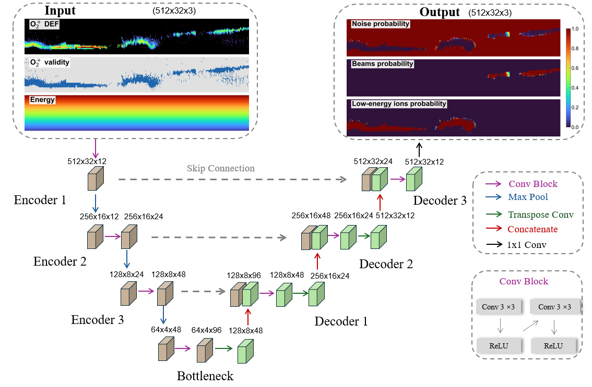
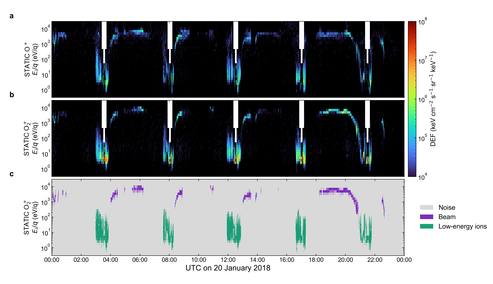

# U-Net Mars O2 Energetic Beams

Inference code and weights for **U-Net v11**, segmenting background-corrected MAVEN STATIC O2+ spectra into Noise, Beam, and Low-energy ions.



Inputs: O2+ log DEF, O2+ validity, normalized log energy. The supplied diagram omits GroupNorm before ReLU.

## Installation and inference

```bash
python -m pip install -r requirements.txt
python -m pip install -e .
python examples/run_example.py --device cpu
python examples/run_example.py --input your_corrected_spectra.npz --output prediction.npz
```

Input NPZ requires `o2_def` with shape `[time,32]` and finite positive `energy_ev` with shape `[32]`. O+ data are not required.

Correct native STATIC C6 backgrounds once using iv4 before summing O2+ mass bins 24 to 40. Interpolate DEF linearly against log10 energy onto the common 32-bin grid. Out-of-range values are NaN. DEF units: keV cm^-2 s^-1 sr^-1 keV^-1. This array API does not read or calibrate raw CDF files. D1 moments are downstream calculations.

```python
from unet_mars_o2_beams import build_input_channels, load_pretrained_model, predict_spectrogram
inputs = build_input_channels(o2_def=o2_def, energy_ev=energy_ev)
model, metadata, device = load_pretrained_model("weights/unet_v11_best_validation.pt")
probabilities, labels = predict_spectrogram(model, inputs, device)
```

272,463 parameters; 512 x 32 windows, stride 256. Overlapping softmax probabilities are averaged before argmax. Outputs: probabilities `[3,time,32]`, labels `[time,32]`, with 0 Noise, 1 Beam, 2 Low-energy ions. Raw inference does not apply production screening or interval merging.

## Real MAVEN example

```bash
python examples/plot_20180120_full_day.py
python examples/plot_20180120_full_day.py --rerun-inference --device cpu
```

The included 20 January 2018 example contains corrected spectra and reproducible raw v11 labels. Its O+ panel supplies context only; O+ is not used by the classifier.



## Beam intervals

[Download 14,484 intervals](catalogs/beam_points_v11_intervals.txt). Three tab-separated columns without a header: sequential ID, start UTC, end UTC. Timestamps retain nanosecond precision. Adjacent retained samples separated by at most 10 minutes are merged. Endpoints are the first and last observed samples.

The curated catalog contains 2,811,946 original v9 samples retained by final v11 screening, with valid MSE and background-corrected D1 moments. No new v11 points are added. Production screening includes H+/O2+ contamination and reviewed exclusions. Integration extends the v11 beam envelope by one native D1 bin at each end. This catalog is distinct from raw network output.

See [MODEL_CARD.md](MODEL_CARD.md).
