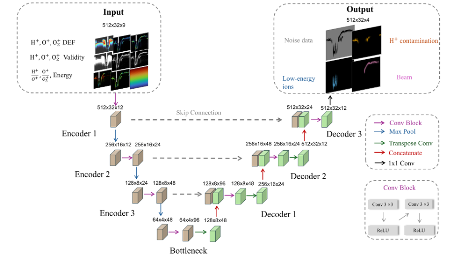
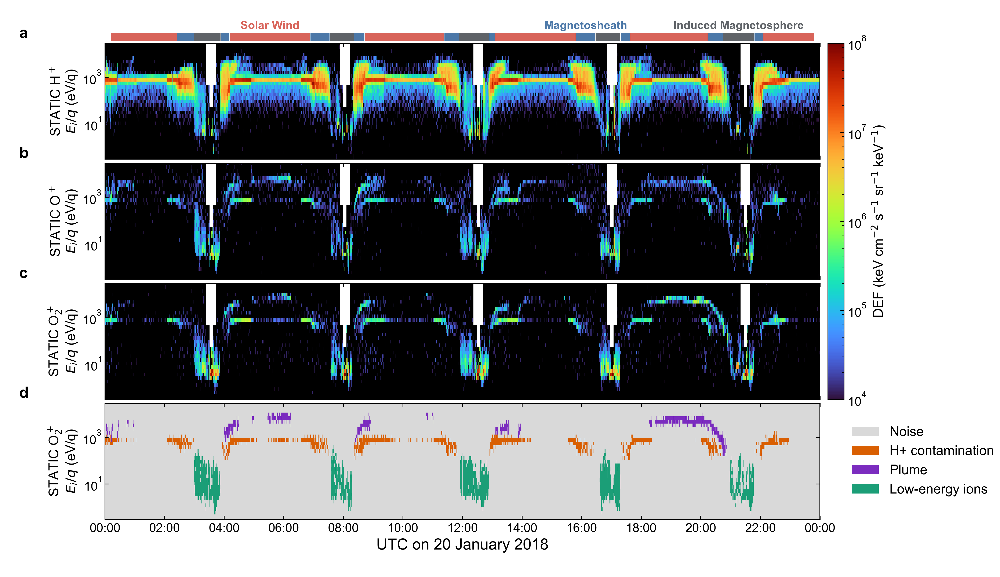

# U-Net Mars O2 Plume

PyTorch code and trained parameters for **U-Net v9**, a semantic-segmentation model developed to identify O2+ plume signatures in MAVEN STATIC energy-time spectrograms.



## Repository contents

```text
unet_mars_o2_plume/
  model.py           U-Net architecture
  preprocessing.py   Nine-channel physical preprocessing
  inference.py       Checkpoint loading and tiled inference
examples/
  run_example.py     Executable synthetic or NPZ example
  plot_20180120_full_day.py
                     Full-day MAVEN STATIC example and four-panel figure
weights/
  unet_v9_best_selection.pt
MODEL_CARD.md         Architecture, performance, and limitations
requirements.txt
```

## Installation

Clone the repository and install the two runtime dependencies:

```bash
git clone https://github.com/ChiZhang123456/U-Net_Mars_O2_Plume.git
cd U-Net_Mars_O2_Plume
python -m pip install -r requirements.txt
python -m pip install -e .
```

Python 3.10 or newer is recommended. PyTorch can run on either CPU or CUDA.

## Quick start

Run the included deterministic synthetic example from the repository root:

```bash
python examples/run_example.py --device cpu
```

This command verifies that the checkpoint loads, performs overlap-averaged inference, and writes `prediction.npz`.

## Full-day MAVEN example: 20 January 2018

The example script accepts aligned MAVEN STATIC H+, O+, and O2+ DEF arrays from
00:00 to 24:00 UTC on 20 January 2018. Reproduce the four-panel example with:

```bash
python examples/plot_20180120_full_day.py --data static_20180120.npz
```

The NPZ file must contain `time`, `energy_ev`, `h_def`, `o_def`, `o2_def`, and
`labels`. The two-dimensional spectra and label map must have shape
`[time, energy]`. An optional region CSV may be supplied with `--regions`; its
columns are `region`, `start_utc`, and `end_utc`.

The default command plots the saved production v9 labels. To rebuild the nine
physical input channels and rerun the released checkpoint before plotting, use:

```bash
python examples/plot_20180120_full_day.py \
    --data static_20180120.npz \
    --rerun-inference
```

The production label map includes the confidence, physical-support, and
connected-component screening used in the catalog workflow. The direct
checkpoint option displays the raw four-class inference after masking invalid
O2+ pixels, so small differences from the production label panel are expected.



## Run on aligned STATIC spectra

Prepare a NumPy NPZ file containing:

| Key | Shape | Description |
| --- | --- | --- |
| `h_def` | `[time, energy]` | H+ differential energy flux |
| `o_def` | `[time, energy]` | O+ differential energy flux |
| `o2_def` | `[time, energy]` | O2+ differential energy flux |
| `energy_ev` | `[energy]` | Positive energy-bin centers in eV |

The three spectra must use the same time and energy grid. Then run:

```bash
python examples/run_example.py --input your_static_spectra.npz --output prediction.npz
```

The output contains:

| Key | Shape | Description |
| --- | --- | --- |
| `probabilities` | `[4, time, energy]` | Overlap-averaged softmax probabilities |
| `labels` | `[time, energy]` | Maximum-probability class index |
| `class_names` | `[4]` | Class names in checkpoint order |
| `energy_ev` | `[energy]` | Input energy-bin centers |

Class index 1 is the O2+ plume class.

## Python API

```python
from unet_mars_o2_plume import (
    build_input_channels,
    load_pretrained_model,
    predict_spectrogram,
)

inputs = build_input_channels(h_def, o_def, o2_def, energy_ev)
model, metadata, device = load_pretrained_model(
    "weights/unet_v9_best_selection.pt"
)
probabilities, labels = predict_spectrogram(model, inputs, device)
plume_mask = labels == 1
```

## Model configuration

The released model has 273,124 parameters and uses:

* 512 time samples per inference window
* 51 sample stride
* 90.039% actual overlap
* nine physical input channels
* four output classes

The best-selection checkpoint was chosen at epoch 3. On the event-level held-out test set it achieved a macro F1 score of 0.9789, macro IoU of 0.9609, and pixel accuracy of 0.9706. See [MODEL_CARD.md](MODEL_CARD.md) for the evaluation context and limitations.

## Scientific use

This repository provides the trained segmentation model and generic array-based inference code. Retrieval and calibration of MAVEN STATIC data are intentionally kept separate because archive access and instrument preprocessing may change. Users should apply the same energy grid, species alignment, validity masks, and physical scaling described in the model card.

When using model output in scientific analyses, visually inspect representative intervals and report any additional event-level or energy-level filtering applied after segmentation.
